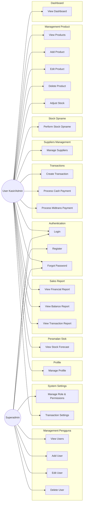

```mermaid
graph LR
    subgraph Authentication
        UC1[Login]
        UC2[Register]
        UC3[Forgot Password]
    end
    
    subgraph Dashboard
        UC4[View Dashboard]
    end
    
    subgraph Management Product
        UC5[View Products]
        UC6[Add Product]
        UC7[Edit Product]
        UC8[Delete Product]
        UC9[Adjust Stock]
    end
    
    subgraph Stock Opname
        UC10[Perform Stock Opname]
    end
    
    subgraph Suppliers Management
        UC11[Manage Suppliers]
    end
    
    subgraph Transactions
        UC12[Create Transaction]
        UC13[Process Cash Payment]
        UC14[Process Midtrans Payment]
    end
    
    subgraph Management Pengguna
        UC15[View Users]
        UC16[Add User]
        UC17[Edit User]
        UC18[Delete User]
    end
    
    subgraph Sales Report
        UC19[View Financial Report]
        UC20[View Balance Report]
        UC21[View Transaction Report]
    end
    
    subgraph Peramalan Stok
        UC22[View Stock Forecast]
    end
    
    subgraph System Settings
        UC23[Manage Role & Permissions]
        UC24[Transaction Settings]
    end
    
    subgraph Profile
        UC25[Manage Profile]
    end
    
    Superadmin((Superadmin)) --> UC1
    Superadmin --> UC2
    Superadmin --> UC3
    Superadmin --> UC15
    Superadmin --> UC16
    Superadmin --> UC17
    Superadmin --> UC18
    Superadmin --> UC23
    
    User((User Kasir/Admin)) --> UC1
    User --> UC3
    User --> UC4
    User --> UC5
    User --> UC6
    User --> UC7
    User --> UC8
    User --> UC9
    User --> UC10
    User --> UC11
    User --> UC12
    User --> UC13
    User --> UC14
    User --> UC19
    User --> UC20
    User --> UC21
    User --> UC22
    User --> UC24
    User --> UC25
```